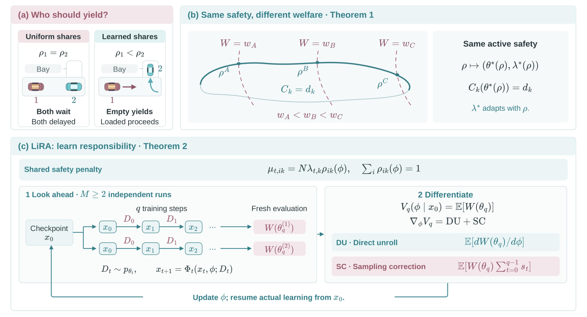

<div align="center">

# Who Bears the Burden? Learning Responsibility for Shared Constraints in Multi-Agent Reinforcement Learning

**LiRA: Lagrangian Responsibility Allocation**

Xiaoyang Cao<sup>1</sup>, Jingqi Li<sup>2</sup>, Zhe Fu<sup>3</sup>, Alexandre M. Bayen<sup>4</sup>

<sup>1</sup>MIT &nbsp; <sup>2</sup>UT Austin &nbsp; <sup>3</sup>Stanford University &nbsp; <sup>4</sup>UC Berkeley

[](https://arxiv.org/abs/2610.07491)
[](https://lira-marl.github.io/)
[](LICENSE)

</div>

When several agents share a constraint (a grid cap, an order-rejection cap, a
safety-event limit), a Lagrangian method must decide **who pays** for it. LiRA keeps
one shared multiplier per constraint and *learns* how its penalty is split
across agents: agent *i* is charged `mu_ik = N * lambda_k * rho_ik(phi)` with
`sum_i rho_ik = 1`. The allocation logits `phi` are trained by differentiating
a short lookahead of the learners' own training (direct unroll plus a
leave-one-out sampling correction), so that the shared budget is still enforced
by the common multiplier while the split is chosen for social welfare.

<p align="center">
  
</p>

## Installation

Python >= 3.10. The core package needs only PyTorch, NumPy and PyYAML; each
benchmark adds its own simulator.

```bash
git clone https://github.com/XiaoyangCao1113/LiRA.git && cd LiRA
pip install -e ".[dev]"          # core + tests
pip install -e ".[citylearn]"    # CityLearn 2.5.0
pip install -e ".[metadrive]"    # MetaDrive 0.4.3
pip install -e ".[mabim]"        # MABIM helpers (ReplenishmentEnv: see below)
pip install -e ".[harvest]"      # dmlab2d (Melting Pot: see below)
```

The same pins are listed in `requirements/<domain>.txt`.

**MABIM** uses [ReplenishmentEnv](https://github.com/VictorYXL/ReplenishmentEnv) at a fixed commit:

```bash
git clone https://github.com/VictorYXL/ReplenishmentEnv.git
git -C ReplenishmentEnv checkout e667565615461ecd4102a60ad1ecd6b772e357d6
export REPLENISHMENT_ENV_ROOT=$PWD/ReplenishmentEnv   # or pass --env-root
```

**Harvest** uses [Melting Pot](https://github.com/google-deepmind/meltingpot)
`commons_harvest__open` at a fixed commit, plus a small patch that exposes the
live apple count (used for the shared cost) without changing rewards or
dynamics:

```bash
git clone https://github.com/google-deepmind/meltingpot.git
git -C meltingpot checkout 817f8c1974863a91909c04c7a69dd33993199ec6
git -C meltingpot apply $PWD/src/lira/envs/harvest/patches/meltingpot_apple_count.patch
pip install -e meltingpot
export MELTINGPOT_SOURCE=$PWD/meltingpot              # or pass --meltingpot-source
```

Melting Pot needs Python >= 3.11, and its `dmlab2d` wheel needs glibc >= 2.29 (older
systems, e.g. RHEL/Rocky 8, must run it in a container). The pretrained bot also needs the
Melting Pot assets, which `pip install -e meltingpot` downloads; afterwards
`meltingpot/meltingpot/assets/saved_models/` must exist (otherwise extract
`meltingpot-assets-2.3.0.tar.gz` from
`https://storage.googleapis.com/dm-meltingpot/` into `meltingpot/meltingpot/`).
If the source tree is not a git checkout (e.g. inside a container), set
`MELTINGPOT_SOURCE_COMMIT=817f8c1974863a91909c04c7a69dd33993199ec6`.

**Initial checkpoints.** MABIM and MetaDrive start every arm from the same
pretrained policy. Download them into `checkpoints/`:

```bash
mkdir -p checkpoints
wget -P checkpoints https://github.com/XiaoyangCao1113/LiRA/releases/download/v1.0/mabim_init_policy.pt
wget -P checkpoints https://github.com/XiaoyangCao1113/LiRA/releases/download/v1.0/metadrive_init_actor.pt
```

## Quick start

Every task has one entry point, `scripts/train_<task>.py`, and one config,
`configs/<task>.yaml`, holding the paper's hyperparameters and training seeds.
Each run trains the three arms compared in the paper:

| arm | shared constraint handling |
|---|---|
| `uniform` | one shared multiplier per constraint, equal shares `rho_ik = 1/N` |
| `pal` | per-agent Lagrangian: one multiplier per agent and constraint |
| `lira` | one shared multiplier per constraint, learned shares `rho_ik(phi)` |

Command-line flags override the config. All runs are CPU-only.

### Reproduce the paper

Each command below trains all three arms on every training seed in the config
and writes their held-out evaluation:

```bash
# CityLearn: 3 buildings, grid demand cap (seeds 1101-1103)
python scripts/train_citylearn.py --config configs/citylearn.yaml --output-dir runs/citylearn

# MABIM: 400 SKU agents, 2 order-rejection caps (seeds 1101-1103)
python scripts/train_mabim.py --config configs/mabim.yaml --evaluate --output-dir runs/mabim

# Harvest: 7 agents, one shared cost (seeds 10411, 10442, 10473)
python scripts/train_harvest.py --config configs/harvest.yaml --output-dir runs/harvest

# MetaDrive: 4 vehicles, safety-event rate (seeds 211-216, one process per seed)
for s in 211 212 213 214 215 216; do
  python scripts/train_metadrive.py --config configs/metadrive.yaml --seeds $s --out runs/metadrive/seed$s.json
done
```

To run a single seed or arm, add `--seed <s>` (MetaDrive: `--seeds <s>`) or
`--arms lira` (MABIM: `--arm lira`); see each script's `--help`.

## Main results

| Task (N, K) | Outcome | Budget | Uniform | PAL | LiRA |
|---|---|---:|---:|---:|---:|
| CityLearn (3, 1) | Welfare (10^3) | – | -16.87 ± 3.04 | -16.87 ± 3.04 | **-14.51** ± 1.66 |
| | Grid excess (kWh) | 28.76 | 28.44 ± 5.97 | 28.44 ± 5.97 | 28.73 ± 7.48 |
| MABIM (400, 2) | Welfare (10^6) | – | -596.31 ± 5.00 | -597.27 ± 3.76 | **-591.36** ± 4.48 |
| | Rejections C1 (10^6) | 20.35 | 21.51 ± 0.25 | 21.56 ± 0.23 | 21.30 ± 0.18 |
| | Rejections C2 (10^3) | 32.69 | 27.71 ± 2.31 | 27.54 ± 2.21 | 28.68 ± 0.90 |
| Harvest (7, 1) | Welfare | – | 42.73 ± 12.22 | 44.73 ± 3.79 | **50.27** ± 2.53 |
| | Shared cost | 68.00 | 33.24 ± 10.08 | 33.38 ± 5.18 | 36.82 ± 2.40 |
| MetaDrive (4, 1) | Welfare | – | 49.72 ± 22.20 | 60.94 ± 13.45 | **64.26** ± 19.98 |
| | Events / 10^3 steps | 1.00 | 1.017 ± 0.343 | 1.337 ± 1.466 | 0.890 ± 0.407 |

Held-out mean ± sample standard deviation over training seeds (three per task;
six for MetaDrive). Bold marks the highest mean welfare.

## Repository structure

```
LiRA/
├── src/lira/
│   ├── responsibility.py   # floored responsibility simplex rho(phi), shared dual lambda
│   ├── ppo.py              # PPO surrogate with effective advantage A^R - sum_k N lambda_k rho_ik A^C_k
│   ├── estimators.py       # leave-one-out baselines, LiRA gradient (DU + SC), outer ascent step
│   └── envs/
│       ├── citylearn/      # CityLearn adapter, functional PPO/Adam lookahead, held-out evaluation
│       ├── mabim/          # ReplenishmentEnv adapter, shared categorical learner, live dual, evaluation
│       ├── harvest/        # Melting Pot adapter, categorical learner, lookahead, patch for Melting Pot
│       └── metadrive/      # MetaDrive adapter, online learner, direct-unroll lookahead
├── scripts/                # train_<task>.py entry points and MABIM evaluation
├── configs/                # paper hyperparameters and seeds per task
├── tests/                  # fast unit tests (no simulator needed)
└── assets/                 # figures
```

Run the tests with `pytest tests/`.

## Citation

```bibtex
@misc{cao2026lira,
  title   = {Who Bears the Burden? Learning Responsibility for Shared Constraints in Multi-Agent Reinforcement Learning},
  author  = {Cao, Xiaoyang and Li, Jingqi and Fu, Zhe and Bayen, Alexandre M.},
  year    = {2026},
  eprint  = {2610.07491},
  archivePrefix = {arXiv},
  url     = {https://arxiv.org/abs/2610.07491}
}
```

## License

This code is released under the [Apache License 2.0](LICENSE).

## Acknowledgments

We build on the following open-source environments and thank their authors:
[CityLearn](https://github.com/intelligent-environments-lab/CityLearn),
[ReplenishmentEnv / MABIM](https://github.com/VictorYXL/ReplenishmentEnv),
[Melting Pot](https://github.com/google-deepmind/meltingpot) and
[DeepMind Lab2D](https://github.com/google-deepmind/lab2d), and
[MetaDrive](https://github.com/metadriverse/metadrive).

## Contact

Questions and issues: please open a GitHub issue or email Xiaoyang Cao (xycao@mit.edu).
